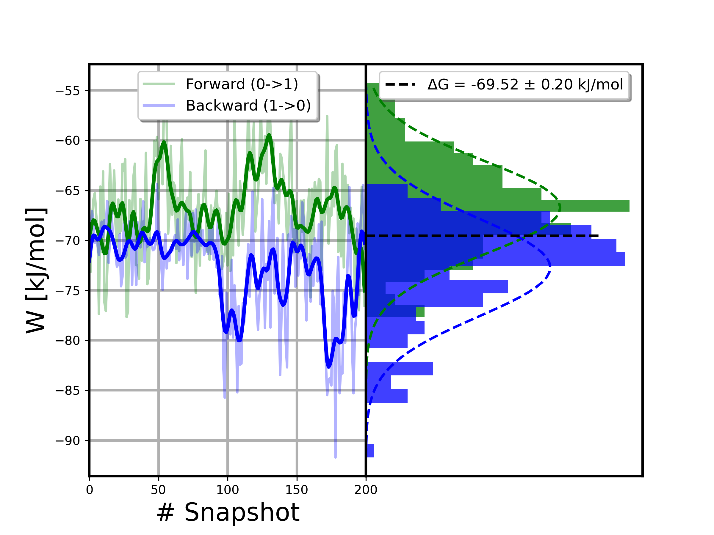

[](https://www.biorxiv.org/content/10.64898/2025.12.09.692605v1)  [](https://nemat.readthedocs.io/en/latest/)


# NEMAT: An Automated Non-Equilibrium Free-Energy Framework for Predicting Ligand Affinity in Membrane Proteins

**NEMAT** (Non-Equilibrium Membrane Alchemical Transformations) is an open-source framework designed to make **non-equilibrium free-energy calculations for ligand binding in membrane proteins accessible, reproducible, and automated.**

Built around established molecular simulation workflows, NEMAT guides users through the full process—from system preparation and execution to analysis—enabling the estimation of ligand binding affinities directly from non-equilibrium molecular dynamics simulations. It is particularly tailored for membrane protein systems, where setup and analysis are often complex and error-prone.

By providing a structured, modular workflow, NEMAT reduces manual intervention, improves consistency across simulations, and allows researchers to focus on interpreting results rather than managing infrastructure.

# 1. Install 

Download NEMAT from GitHub using:

```bash
git clone https://github.com/QTC-IQAC/NEMAT.git
```

First set up env:

```bash
cd NEMAT
bash bin/set_env.sh
```

Then give execute permissions to the NEMAT executable
```bash
chmod +x $NMT_HOME/bin/nemat
```

If using `nemat` is not available, try updating the `.bashrc` file:

```bash
source ~/.bashrc
```

# 2. Prepare directory for a NEMAT run:  `nemat start`.

Create a new **empty** directory and, inside the directory, use:

```bash
nemat start 
```

This will copy into your directory the following elements:

1. A folder named `membrane`
2. A folder named `proteins`
3. A folder named `mdppath`
4. A folder named `ligands`
5. A folder named `logs`
6. A file named `input.yaml`

 Now you have the structure to start a NEMAT run.

# 3. Prepare the membrane-embedded protein (MEP) system.

## 3.1. Creating the MEP system using CHARMM-GUI.

Prepare the membrane-embedded protein system using CHARMM-GUI, making sure that the protein is correctly placed in the membrane. Use only POPC for the membrane for a simple yet effective membrane. While the lipid is characterized in AMBER, it should be no problem to use a more complex membrane (i.e., add cholesterol).

Remember to align the protein to the Z axis and use the AMBER FF. The membrane must be parametrized with AMBER for a better reliability with GAFF2, with which the small molecules are parametrized.

Use only the *gromacs* folder of the output generated by CHARMM-GUI. Rename the following files provided by CHARMM-GUI:

1. *step5_input.gro*   -->   `system.gro`
2. *topol.top*              -->   `system.top`  

The *proteins* folder should contain at least the following files per protein (*prot1*, *prot2*, etc):

		proteins
		  |  |
		  |  |-- prot1
		  |  |    |
		  |  |	  |-- toppar
		  |  | 	  |-- system.gro
		  |  |	  |-- system.top
		  |  |	 	
		  |  |-- prot2
		  |  |    |
		  |  |	  |-- toppar
		  |  | 	  |-- system.gro
		  |  |	  |-- system.top
		  |  |	 	
		  |  |-- ...

## 3.2. Using a different method. 

NEMAT searches for the files `system.top` (which references files inside the `toppar` folder), `system.gro`, and the folder `toppar`. Therefore, any set of files following this structure is a valid input for NEMAT. 

> [!NOTE]
> Actually, you could just change a force field folders name by `toppar` and change the `#include` inside the topology file. This would provide a valid input for NEMAT.

If you are using a custom force field, it is recommended to use the same for the membrane system. 


# 4. Prepare the membrane system. 

Prepare a bilayer membrane system that is consistent with the membrane-embedded protein  system. This means using the same kind of water (TP3, OPC...), the same AMBER FF, and the same lipids that are on the membrane (usually only POPC). 

The *XY* size of the box can be of approximately 4 nm (40 Angstroms), which means 24 POPCs per layer. For very large ligands (or peptides), this must be increased, which will only have an effect on the running time.  

**A standard POPC membrane is provided and can be used. The size of the membrane is 4 nm (XY) and the ions used are Na+ Cl-. If you use this membrane, you can skip to the next section.**

## 4.1. Create the membrane system using CHARMM-GUI.

As in the MEP system, take from the *gromacs* folder and change the *step5_input.gro* file name for *membrane.gro* and the *topol.top* for *membrane.top*. Add them to the `membrane` folder.

The *membrane* folder should contain at least the following:

		membrane
		  |  |
		  |  |-- toppar
		  |  |-- membrane.gro
		  |  |-- membrane.top

## 4.2. Using a different method.

NEMAT searches for the files `membrane.top` (which references files inside the `toppar` folder), `membrane.gro`, and the folder `toppar`. Therefore, any set of files following this structure is a valid input for NEMAT. 

> [!NOTE]
> Actually, you could just change a force field folders name by `toppar` and change the `#include` inside the topology file. This would provide a valid input for NEMAT.

If you are using a custom force field, it is recommended to use the same for the MEP system. 


# 5. Prepare the ligands.

## 5.1. Obtaining the reference ligand: `ref_lig.pdb`.

First of all we need to align the reference protein + ligand system (i.e., a crystallographic structure from the PDB containing the protein and the docked ligand) to the newly generated GROMACS system. Use VMD or any aligning tool to align the two proteins. For VMD, you could do:

1. Load the two proteins. In this case: `system.gro` and `prot_lig.pdb`. 
2. Go to `Extensions > Analysis > RMSD calculator`.  This will display a new window.
3. At the top left box, type `name CA`.
4. Unclick the option *Backbone only*.
5. Click *Align* to align the two systems.
6. Save the new ligand coordinates.

> [!WARNING]
> It is important that the GROMACS system (`system.gro`) is marked with the option *"T"* on the VMD main page. If not, the whole system will be aligned to the protein and not the other way around.

Then extract the ligand, which will serve as a reference for aligning the other ligands. Save it as *ref_lig.pdb*.

## 5.2. Aligning the ligands.

Add hydrogens to the reference ligand and to the rest (for example, using CHARMM-GUI). You can manually align the ligands and  directly save the _mol2_ files at the _ligands_ folder.

If you have *pdb* files of the ligands, the `align.sh` file might be useful. Save all the pdb files of your ligands inside the "*/ligands/ligands*" folder and the *ref_ligand.pdb* on the "/ligands" folder. Then use:

```bash
cd ligands
bash align.sh
```


This will generate `ligands.sdf` and all the necessary files: it will align the ligands with the reference ligand and then generate *mol2* files for every ligand. 

You can use the *ligands.sdf* file to both visualize all the ligands at once and, for example, to use some program such as [openFE](https://colab.research.google.com/github/OpenFreeEnergy/ExampleNotebooks/blob/main/openmm_rbfe/OpenFE_showcase_1_RBFE_of_T4lysozyme.ipynb) to generate a mapping of the ligands and determine the possible edges.

The *ligands* folder should contain the *mol2* of all the ligands: 

		ligands
		  |  |
		  |  |-- lig1.mol2
		  |  |-- lig2.mol2
		  |  |-- lig3.mol2
		  |  |-- ...


> [!NOTE]
> Check that the ligand alignment is correct. If the molecule is small, it is possible that something went wrong.
> 
> You can manually align the ligands and directly save the *mol2* files at the *ligands* folder.


# 6. About the *mdp* files

There are some things that may be difficult to track about the *mdp* files. One of them is the `tc-grps` and how they are defined. For the protein we have:

```bash
tc_grps = SOLU MEMB SOLV
```

Where SOLV (for solvent) includes the water and the ions, MEMB is the membrane, and SOLU (for solute) is the protein and the ligand. On the `_prepare_prot_tpr()` and `_prepare_memb_tpr()` functions from `src/NEMAT/nemat.py`, an index is generated and used in the `grompp` automatically. If you are having problems, look there :).

Again, the program assumes that the input files were generated using CHARMM-GUI. For the membrane, we have:

```bash
tc_grps = MEMB SOLV LIG
```

Which is as stated before, but now the ligand, since it's the only solute, is named LIG.

The default *mdp* files are stored in the *mdppath* folder. This folder contains:
	
1. Minimization files for the protein, the ligand, and the membrane systems. These are named as "prot_em_l0.mdp".
2. Equilibration files for  the protein (6), the ligand (1), and the membrane (6) systems. These are named as "prot_eq(n)\_l0.mdp" where $n \in [1,6]$.
3. Production files for the protein, the ligand, and the membrane systems. They are named as "prot_md_l0.mdp". 
4. Finally, the transitions files are named as "prot_ti_l0.mdp".

> [!NOTE]
> If you are using your own *mdp* files, don't forget to add the free energy inputs to all the *mdp* files. At least the `init-lambda` parameter is needed to indicate if the ligand is in state A or B. At the transitions, the other parameters become relevant:
> 
> ```mdp
>; Free energy control stuff
> free-energy = yes
> init-lambda = 0 ; 0 for state A and 1 for state B
> delta-lambda = 0
> sc-alpha = 0.3
> sc-sigma = 0.25
> sc-power = 1
> sc-coul = yes
> ```


# 7. Set up of NEMAT: the `input.yaml` file

An example of an input for the FEP simulation can be found in `input.yaml`:

```yaml
##############################
#       PREPARE INPUTS       #
##############################

inputDirName: 'input_name'             # path to the directory where the input files will be located. 
proteinName: 'prot_name'               # name of the protein in inputDirName/proteins that will be used.


##############################
#      SIMULATION INPUTS     #
##############################


workPath: 'workpath_name'                # path to the directory where the simulations will run
replicas: 3                              # set the number of replicas (several repetitions of calculation are useful to obtain reliable statistics)
edges:                                   # List of lists containing the edges.  
  - ['small_molec_1', 'small_molec_2']   # without the .mol2 
  - ['small_molec_1', 'small_molec_3']
  - ['small_molec_2', 'small_molec_3']

pname: 'NA'                              # Which positive ions to use in the ligand simulations
nname: 'CL'                              # Which negative ions to use in the ligand simulations 
# slotsToUse: 6                          # Use if you want to limit the number of jobs running at the same time in the cluster.
saveFrames: 200                          # Number of frames to save in the production MD. The default is 400 frames.
frameNum: 100                            # Number of frames to extract to make transitions. The default upper limit is frameNum.
temp: 298                                # Temperature of the systems.
units: 'kcal'                            # Units for the free energy calculations ("kJ" for kJ/mol or "kcal" for kcal/mol)
mdtime: 20                               # Production MD time in ns. If you want to use the time in the mdp files, don't set this parameter or set it to None.
titime: 0.2                              # Transition MD time in ns. If you want to use the time in the mdp files, don't set this parameter or set it to None.
tstart: 5                                # Starting time (in ns) to extract frames from the production MD for transition simulations. If None, tstart will be determined by frameNum.


##############################
#    JOB SUBMISSION INPUTS   #
##############################

JOBsimcpu: 24                            # Number of CPUs to use for the simulation jobs
JOBmodules:                              # List of modules to load for the simulation jobs
  - 'gromacs-plumed/2024.2-2.9.2'  
JOBgmx: 'gmx mdrun -maxh 72'             # Command to run the simulation jobs
JOBpartition: 'gpu'                      # Partition to use for the simulation jobs
JOBsimtime: '3-00:00'                    # Time limit for the simulation jobs. Can be set to none.
JOBmpi: False                            # Set to True if you want to specifically display -ntmpi 1 (solves problem of rank division)
JOBexport:                               # List of environment variables to export for the simulation jobs (the jobs will include "export SET_SOME_VAR=1")
  - 'SET_SOME_VAR=1'

JOBsource:                               # List of source files to run before the simulation jobs (the jobs will include "source file.sh")
  - 'file.sh'                          
              
JOBcommands:                             # List of commands to run before the simulation jobs 
  - 'conda activate NEMAT'    
  
  
##############################
#          ANALYSIS          #
##############################

precision: 1                             # Number of decimal places to use in the analysis output (results.png)
framesAnalysis: [start_frame, end_frame] # List of frames to analyze. If you want to analyze all frames, ignore this field. 
nframesAnalysis: 80                      # Number of frames to use in the analysis (max frameNum, which is the number of transitions).
spacedFrames: False                      # if True, nframesAnalysis are evenly spaced. If False, all frames in nframesAnalysis are selected

```

Remember to load GROMACS using `JOBmodules` if it's a module or manually. More modules can be loaded, but only GROMACS is strictly necessary. 

On the other hand, it is important that the GROMACS executable `gmx` exists. If you only have `gmx_mpi` as an executable, the program will fail.

Other options for the input file are:

----> LIST OF OPTIONS <----


## 7.1. Job script setup.

Aside from the obvious parameters, the following things may be of your interest.

* `JOBsimtime` is the time that will be used for the minimization, equilibration, production, and transition jobs. If it is not set, no time will appear in these jobs. 
* `JOBmpi`, depending on your GROMACS installation, you may have to explicitly state `-ntmpi 1` to avoid a ranks error. This option does it for you. 
* You can always add whatever you want to the `JOBgmx` command if your cluster has a specific problem. For example, it is a good idea to add *-maxh 72* if you set `JOBsimtime` to 3 days.

## 7.2. Production and Transitions setup.

The production will save `saveFrames` frames. This means that, at maximum, you will be able to perform `saveFrames` transitions. 

The number of transitions is selected with `frameNum`. If this is bigger than `saveFrames`, there will be `saveFrame` transitions, which is the maximum available. If not, the `frameNum` transitions will be the last `frameNum`  saved frames. 

In case that `tstart` is defined (recommended), the `frameNum` transitions will be evenly spaced from `tstart` to the total simulation time. If it can not be evenly spaced, NEMAT will take as much evenly spaced transitions as possible and select the remaining ones randomly. For example, if I have a simulation of 20 ns, `saveFrame = 200`, `frameNum = 100`, and `tstart = 5 ns`, this would lead to 150 available frames for transitions, which is not divisible by 100. Then 75 evenly spaced frames would be taken, and 25 out of the remaining possible frames would be selected at random. The selected frames can be found inside *your_workpath/edge_a_b/system/runX/transitions/extracted_frames.txt*


## 7.3. Analysis setup.

The analysis parameters are only needed for the analysis step. This means that you can modify them even after the transitions have run. 

The analysis setup aims to be as flexible as possible to enable the user to perform as many different analysis as possible without rerunning anything. 

Go to the analysis section for more information about the analysis parameters. 

# 8. Running NEMAT. 

Use `nemat` or `nemat help` to display all the options. You can use `nemat wf` to display a simplified workflow for a NEMAT run:

```
>>> submit this steps sequentially for a complete NEMAT run... ([ ]  <-- You are here!  marks the last completed step)

	 1. Prepare the system        : nemat prep

   [ 2. Prepare minimization      : nemat prep_min ] 	 <-- You are here!

	 3. Run minimization          : nemat run_min

	 4. Prepare equilibration     : nemat prep_eq
	 5. Run equilibration         : nemat run_eq

	 6. Prepare production        : nemat prep_md
	 7. Run production            : nemat run_md

	 8. Prepare transitions       : nemat prep_ti
	 9. Run transitions           : nemat run_ti

	10. Analyze results           : nemat analyze

```

> [!NOTE]
> You can always use `nemat check_{step}` to display the warnings and errors that occurred during the preparation of a specific step (*prep*, *min*, *eq*, *md*, *ti*, or *analyze*). 
> 
> This will display the warnings and errors **produced by GROMACS**. Each warning and error is titled as error\_{line} or warning\_{line} where *line* is the line of the original file where the error occurred.
> 
> *IMPORTANT: the check file only searches errors produced by GROMACS. If the program has failed before completing every step, you won't be able to use `check_{step}` to find the error. Look at the corresponding log in the `logs` folder.* 

## 8.1. Prepare the system. 

First of all, generate the structure of the simulation results and also process the ligand with *acpype* (creates GROMACS files of the ligands):

```bash
nemat prep
```

Check the new input folder that was created. It must contain:

1. A folder named *ligands* containing all the ligands involved in the edges.
2. A folder named *proteins* containing the protein files.
3. A folder named *membrane* containing the membrane files.
4. A folder named *mdppath* containing the *mpd* files for the simulations.

Also, a workpath folder has been created: 

```bash
/path/to/workpath/
|
|--edge_lig1_lig2
|--|--water
|--|--|--stateA # ligand 1 (lambda 0)
|--|--|--|--run1/2/3 # number of replicas
|--|--|--|--|--em/eq/md/transitions
|--|--|--stateB # ligand 2 (lambda 1)
|--|--|--|--run1/2/3
|--|--|--|--|--em/eq/md/transitions
|--|--membrane
|--|--|--stateA
|--|--|--|--run1/2/3
|--|--|--|--|--em/eq/md/transitions
|--|--|--stateB
|--|--|--|--run1/2/3
|--|--|--|--|--em/eq/md/transitions
|--|--protein
|--|--|--stateA
|--|--|--|--run1/2/3
|--|--|--|--|--em/eq/md/transitions
|--|--|--stateB
|--|--|--|--run1/2/3
|--|--|--|--|--em/eq/md/transitions
|--|--hybridStrTop # hybrid topology of lig1 and lig2
|--edge_..
```

Using `nemat check_prep` will print a summary of the system parameters. If you want to change any parameter of the `input.yaml` file, you can now use `nemat update`, which will check that all involved files are corrected and will print the same summary:

```bash
-->-->--> System check <--<--<--

-- SIMULATION TIMES (ns) --
+------------+------------+------------+------------+
|            | eq         | md         | ti         |
+------------+------------+------------+------------+
| water      | 0.5        | 20         | 0.2        |
| membrane   | 1.5        | 20         | 0.2        |
| protein    | 1.5        | 20         | 0.2        |
+------------+------------+------------+------------+

-- INFO --

|	--> Frames saved in md          : 200
|	--> Number of transitions       : 100
|	--> dt transitions              : 0.15 ns
|		--> This means that the first transition frame would be 50 (at 5.0 ns).
|
|	--> Transitions for analysis    : 100
|	--> Spaced frames for analysis  : True
|
|	--> Replicas per system         : 1
|	--> Simulations will run for 1 edges.
|		--> This means 6 jobs per step.
|
|	--> Edges:
		  * edge_a_b
|
|	--> Temperature                 : 298 K
|	--> Charge type                 : bcc
|	--> Results will be in          : kcal
|
|	--> CPUs per job                : 8 
|	--> GPU enabled                 : True.

```

## 8.2. Minimization.

You can prepare the minimization files by using:

```bash
nemat prep_min
```

This will generate all the job scripts for the SLURM cluster. The generated jobs (`jobscript{n}`) and submission job (`submit_jobs.sh`) can be found at your workpath, where you will find a folder named `em_jobscripts`.  It is highly recommended to check if there were any GROMACS errors when the minimization preparation ends:

```
nemat check_min
```

To submit the job array:

```bash
nemat run_min
```

Or, if you are sure that the preparation will be successful, you can use the job ID of the preparation job to submit with an "afterok" dependency the minimization jobs:

```
nemat run_min job_id
```

When the jobs finish running, you may use 

```bash
nemat s_min
```

to check if all the jobs have been successful. If not, the program will indicate which jobs (*job_num*) failed so you can look at the corresponding logs (at *your_workpath/em_jobscripts*, named `job_{job_id}_{job_num}.out`). 

### 8.2.1. Errors during minimization.

During the minimization is where most of the GROMACS errors may occur due to placing the hybrid small molecule in a precoumputed system. Since the protein pocket is usually "empty", the most problematic systems are usually the membrane ones. The most common errors are:

> [!CAUTION]
> Energy minimization has stopped, but the forces have not converged to the
requested precision Fmax < 1000 (which may not be possible for your system).
It stopped because the algorithm tried to make a new step whose size was too
small, or there was no change in the energy since the last step. Either way, we
regard the minimization as converged to within the available machine
precision, given your starting configuration and EM parameters.

Even though this is not explicitly a GROMACS error, this must be avoided at all costs. Usually, this will lead to something like:

```bash
Potential Energy  =  4.8533396e+09
Maximum force     =  1.2402948e+12 on atom 8201
Norm of force     =  3.6336824e+09
```

Which logically will eventually crash during the equilibration. This error occurs because the ligand was placed to near from an existing atom but not close enough for the system to crash. Luckily, this error is usually solvable:

1. Use `nemat atom`. This will copy `find_atom.tcl` in your directory and provide you with simple instructions:

```bash
Use it in VMD to find atom indices as follows:
	 > Open the gro file that fails (e.g., membrane.gro) with VMD
	 > Open find_atoms.tcl and change the atom index on the first line (0-based)
	 > Then, at the VMD command prompt, type: source find_atom.tcl
	 > The atom will be highlighted in red. Move it to avoid crashes

```

2. Inside `find_atoms.tcl` find `set atomIndex 118` (line 2) and change the atom index for the index that GROMACS provided you (i.e., in our example, is atom 8201, therefore we would set `set atomIndex 8200` since it's 0-based).
3. Go to *your_workpath/edge_that_failed/system*. Here is where the *.gro* file that needs to be modified is. 
4. Open this file with VMD and source the *tcl* file. 
5. Manually correct the atom(s) position(s). Don't worry if the structure is no exactly the one previous to the changes, the force field will do its work and reshape it during the minimization.
6. Save the new *gro* file and replace the original one. 

Now change your input file to avoid rerunning things that are errorless:

1. Comment the edges that are okay.
```yaml
edges:                                   # List of lists containing the edges.  
 # - ['small_molec_1', 'small_molec_2']   # without the .mol2 
  - ['small_molec_1', 'small_molec_3']
 # - ['small_molec_2', 'small_molec_3']
```

2.  Use `thermCycleBranches` to select only the branch that failed.
```yaml
thermCycleBranches: 
  - 'membrane'                         # Select only this branch because we are fixing it. 
```

3. Update with the new parameters.
```bash
nemat update
```

Now restart the minimization. 

> [!important]
> Remember to change back the parameters of `input.yaml` after running the new minimization. Then use again `nemat update`.


## 8.3. Equilibration.

You can prepare the equilibration files by using:

```bash
nemat prep_eq
```

This will generate all the job scripts for the SLURM cluster. The generated jobs (`jobscript{n}`) and submission job (`submit_jobs.sh`) can be found at your workpath, where you will find a folder named `eq_jobscripts`.  It is highly recommended to check if there were any GROMACS errors when the equilibration preparation ends:

```
nemat check_eq
```

To submit the job array:

```bash
nemat run_eq
```

Or, if you are sure that the preparation will be successful, you can use the job ID of the preparation job to submit with an "afterok" dependency the equilibration jobs:

```
nemat run_eq job_id
```

When the jobs finish running, you may use 

```bash
nemat s_eq
```

to check if all the jobs have been successful. If not, the program will indicate which jobs (*job_num*) failed so you can look at the corresponding logs (at *your_workpath/eq_jobscripts*, named `job_{job_id}_{job_num}.out`). 

## 8.4. Production.

You can prepare the production files by using:

```bash
nemat prep_md
```

This will generate all the job scripts for the SLURM cluster. The generated jobs (`jobscript{n}`) and submission job (`submit_jobs.sh`) can be found at your workpath, where you will find a folder named `md_jobscripts`.  It is highly recommended to check if there were any GROMACS errors when the production preparation ends:

```
nemat check_md
```

To submit the job array:

```bash
nemat run_md
```

Or, if you are sure that the preparation will be successful, you can use the job ID of the preparation job to submit with an "afterok" dependency the production jobs:

```
nemat run_md job_id
```

When the jobs finish running, you may use 

```bash
nemat s_md
```

to check if all the jobs have been successful. If not, the program will indicate which jobs (*job_num*) failed so you can look at the corresponding logs (at *your_workpath/md_jobscripts*, named `job_{job_id}_{job_num}.out`). 

## 8.5. Transitions.

You can prepare the production files by using:

```bash
nemat prep_ti
```

This will generate all the job scripts for the SLURM cluster. The generated jobs (`jobscript{n}`) and submission job (`submit_jobs.sh`) can be found at your workpath, where you will find a folder named `transition_jobscripts`.  It is highly recommended to check if there were any GROMACS errors when the transition preparation ends:

```
nemat check_ti
```

To submit the job array:

```bash
nemat run_ti
```

Or, if you are sure that the preparation will be successful (this preparation will last for longer, so this is recommended), you can use the job ID of the preparation job to submit with an "afterok" dependency the transition jobs:

```
nemat run_ti job_id
```

When the jobs finish running, you may use 

```bash
nemat s_ti
```

to check if all the jobs have been successful. If not, the program will indicate which jobs (*job_num*) failed so you can look at the corresponding logs (at *your_workpath/transition_jobscripts*, named `job_{job_id}_{job_num}.out`). 

### 8.5.1. Rerun transitions in a different directory: `nemat copy`.

The `nemat copy` option enables the user to copy a directory up to a certain step to another directory. This might be useful if you want, for example, to use the already run dynamics, but increase the number of transitions. 

After using `nemat copy` **from the directory you want to copy**, you will be prompted for:

1. The destination directory (absolute path to an empty directory).
2. Up to which level you want to copy (eq, md, or all)

Then, NEMAT will:

* Copy the workpath up to the specific level.
* Copy the input folder.
* Create a logs folder.
* Copy the `input.yaml` from the source.

This is enough to run anything above `nemat prep`. Back to the example, after doing the copy, we would change `input.yaml` (increase `frameNum`) and then continue with `nemat update`  (to update the new parameter) and, finally, `nemat prep_ti`....


# 9. Obtain the results: `nemat analyze`.

## 9.1. Analysis setup and running.

There are 4 basic options to control the analysis:
1. `nframesAnalysis`: how many of the computed transitions will be used for the analysis. 
2. `framesAnalysis`: Which transitions are included in the analysis.
3. `spacedFrames`: If the frames for analysis should be evenly spaced or not. 
4. `precision`: Number of decimals in the results image. It does not affect the results files.

The `framesAnalysis`, combined with the `nframesAnalysis` parameter, can be used for the following options (take into account that the frame numbers are 0-based):

 * If it is unset, the  last `nframesAnalysis` will be used **for the analysis**.
 * If the value is [n], the analysis will start from the *n* frame up to `nframesAnalysis`. If there are less available frames than `nframesAnalysis`, the program will use the maximum frames possible. 
 * If the value is [n,m], the analysis will be conducted for the frames in the interval *n*  to *m* (both included). Again, If there are less available frames than `nframesAnalysis`, the program will use the maximum frames possible.
 * If the value is a list containing *n* frames (i.e. [1,5,20,31,...]), only these frames will be used for the analysis (`nframesAnalysis` will be ignored).

The `nframesAnalysis` parameter can also be paired with the `spacedFrames` parameter. Then, `nframesAnalysis` equally spaced frames will be selected from the transitions (or the selection by `framesAnalysis`). If the spacing is lower than 1, all frames will be selected, and a warning will raise. 

------------------------------------------------------------------------
####								EXAMPLES

Following the previous case, we have 100 transitions since we set `saveFrames = 200`, `tstart = 5 ns`, and `frameNum = 100`.  Even though the transitions start from frame 50, they will be named from 0 to 99.

#### 1. `framesAnalysis = [0,49]`,  `nframesAnalysis = 100` and  `spacedFrames = false` 

This would return an analysis of 51 frames, including 0 and 49. `framesAnalysis` would be ignored since there aren't 100 frames available in the interval.

#### 2. `framesAnalysis = unset`,  `nframesAnalysis = 50` and  `spacedFrames = False` 

This would return an analysis of the last 50 frames (from 50 to 99 both included). 

#### 3. `framesAnalysis = unset`,  `nframesAnalysis = 50` and  `spacedFrames = True`

This would return an analysis of 50 evenly spaced frames: [0,2,4,6,....] 

#### 4. `framesAnalysis = [20,80]`,  `nframesAnalysis = 30` and  `spacedFrames = False`

This would return an analysis of the last 30 frames of the interval, from 51 to 80.

#### 5. `framesAnalysis = [1,5,6,8,15,...]`,  `nframesAnalysis = unset` and  `spacedFrames = False`

This would return an analysis of n frames: [1,5,6,8,15,...] 

------------------------------------------------------------------------

In the input file, you can choose in which units the results will be (`units`). This will only change the analysis and has no effect on the transitions.

The printed results come from a Gaussian weighted mean, such that the weights are:

$$\omega_i = \sum_j e^{\frac{x_i-x_j}{2\sigma^2}}$$

And the average is then:

$$\bar{x} = \frac{\sum_i \omega_i x_i}{\sum_i \omega_i}$$

You can perform a complete analysis of the FEP calculation by using:

```bash
nemat analyze
```

## 9.2. Result files

This will create the files `results_all.csv` and `results_summary.csv` in your working directory. The first file contains:

```csv title:results_all.csv
edges,DG,err_analyt,err_boot,framesA,framesB
edge_lig1_lig2_water_1,10.16,0.06,0.06,100.0,100.0
edge_1ig1_lig2_protein_1,4.18,0.14,0.11,100.0,100.0
edge_lig1_lig2_membrane_1,7.09,0.2,0.19,100.0,100.0
[...]
```

For every edge and for every replica. At the end, you can find the mean and the error per edge:


```csv title:results_all.csv
edges,DG,err_analyt,err_boot,framesA,framesB
[...]
edge_lig1_lig2_water,10.16,0.06,0.06,,
edge_lig1_lig2_protein,4.18,0.14,0.11,,
edge_lig1_lig2_membrane,7.09,0.2,0.19,,
[...]
```

In this case, for the *edge_lig1_lig2*, we have:

$$\Delta G_{w} = 10.16\pm 0.06 $$
$$\Delta G_{p} = 4.18 \pm 0.11 $$
$$\Delta G_{m} = 7.09 \pm 0.19 $$

The other file, contains information about the $\Delta\Delta G$ values for every edge:

```csv title:results_summary.csv
edges,DDG_obs,DDG_int,DDG_mem,err_analyt_obs,err_boot_obs,err_analyt_int,err_boot_int,err_analyt_mem,err_boot_mem
edge_lgi1_lig2,-5.98,-2.91,-3.0700000000000003,0.15231546211727817,0.12529964086141668,0.24413111231467408,0.21954498400100148,0.208806130178211,0.19924858845171275
edge_lig1_lig3,-2.0,-0.30999999999999983,-1.69,0.12083045973594572,0.1118033988749895,0.2640075756488817,0.18027756377319948,0.24515301344262524,0.15811388300841897
[...]
...
```

Again, for the *edge_lig1_lig2*, we have:

$$\Delta \Delta G_{obs} = -5.98 \pm 0.12 $$
$$\Delta G_{int} = -2.9 \pm 0.2 $$
$$\Delta G_{mem} = -3.1 \pm 0.2 $$

## 9.3. Plots

Inside the work path folder, you will find a folder named `plots` which contains $3\cdot e \cdot r$ plots where $e$ is the number of edges and $r$ the number of replicas per edge (i.e., if we have one edge and 3 replicas, this would mean 9 plots). 

These plots show the forward and backwards transitions of the alchemical transformation:



You want as much overlap as possible. More overlap means less error in the predicted free energy. Usually, the water alchemical transformation has good overlap, and the difficulties come with the protein or, sometimes, at the membrane.

You can easily modify the colors of the plot using the `color_f` and `color_r` in the `input.yaml`.

In order to obtain the final value for every $\Delta G$, a weighted mean is performed so that if one value seems off (for example, because there is nearly no overlap), its weight is low.

Inside every edge, you will find a summary of the results in the image named *results.png*:


This contains, in a graphical way, the results of the `results_summary.csv`. You can tune the number of decimals (`precision`, recommended no more than 3) and use:

```bash
nemat img
```

To redo all the images without redoing the analysis.

## 9.4 Validation.

Use `nemat val` to print the validation test for every edge after the analysis has been performed. NEMAT will check the overlap of the forward and backwards transitions. If the overlap is $\ge 0.2$, then it is considered a good overlap. Use this validation to check if the results make sense or not. Loads of non-overlapping results might lead to incorrect results. Therefore, if that's the case, try increasing the number of transitions in the analysis or making them longer (not more than 1 ns since it's non-equilibrium FEP). 

This is not imperative. You may have a good system with low overlap. However, it is useful to know this metric.

# 10. Other features.

## 10.1. Clean backup files: `nemat clean`.

Since multiple edges can be run at once, the number of useless backup files generated can grow quite high. Hence, you can use `nemat clean` to erase all backup files. If you do so, a message will be prompted indicating how much space the files occupy and how many files there are. If you choose to remove them, all of them will be erased.

## 10.2. Reset run: `nemat new`.

In case you need to start your run again (for example, you find an error), using `nemat new` will reset the workspace so that you need to start from the preparation of the system but maintaining all the other files (like `input.yaml`).

## 10.3. Changing the name of the directory.

If you rename the directory where you are running NEMAT, trying to run anything will cause an error since the paths of the topology are for the other directory. You must run 

```bash
nemat prep. 
```
before continuing with anything else, to ensure that all the internal paths are correct. Using `nemat update` is not possible here. 

`nemat update` is useful in the following contexts:

1. You change a parameter that affects an _mdp_ file (`mdtime`, `titime`)
2. You change a parameter that affects the SLURM parameters (`JOBsimtime`)

Elsewhere, the parameters will be automatically updated when using any NEMAT command (for example, when changing analysis parameters, you don't need to update)


# 11. Reproduce the results of the paper.

NEMAT allows you to create a starting directory with the precomputed input files used in the paper (DOI (preprint): https://www.biorxiv.org/content/10.64898/2025.12.09.692605v1). Follow these steps:

1. Create a new directory (for example, nemat\_test).
2. `cd nemat_test`
3. `nemat example`
4. You can now follow the steps from section 8.

In case you want to reproduce the 6a analogues (Tab. 2), you must change the edges in `input.yaml` with:

```bash
edges:                                 # List of lists containing the edges.  
  - ['6a', '6i']
  - ['6a', '6f']
  - ['6a', '6h']
  - ['6a', '6m']
  - ['6a', '6g']
  - ['6a', '6l']
  - ['6a', '6j']
  - ['6a', '6n']  
```


# License

This work is licensed under the Creative Commons Attribution-NonCommercial-NoDerivatives 4.0 International (CC BY-NC-ND 4.0) license.

You are free to:

* Share — copy and redistribute the material in any medium or format

Under the following terms:

* Attribution — You must give appropriate credit, provide a link to the license, and indicate if changes were made.

* NonCommercial — You may not use the material for commercial purposes.

* NoDerivatives — If you remix, transform, or build upon the material, you may not distribute the modified material.

* No additional restrictions — You may not apply legal terms or technological measures that legally restrict others from doing anything the license permits.
