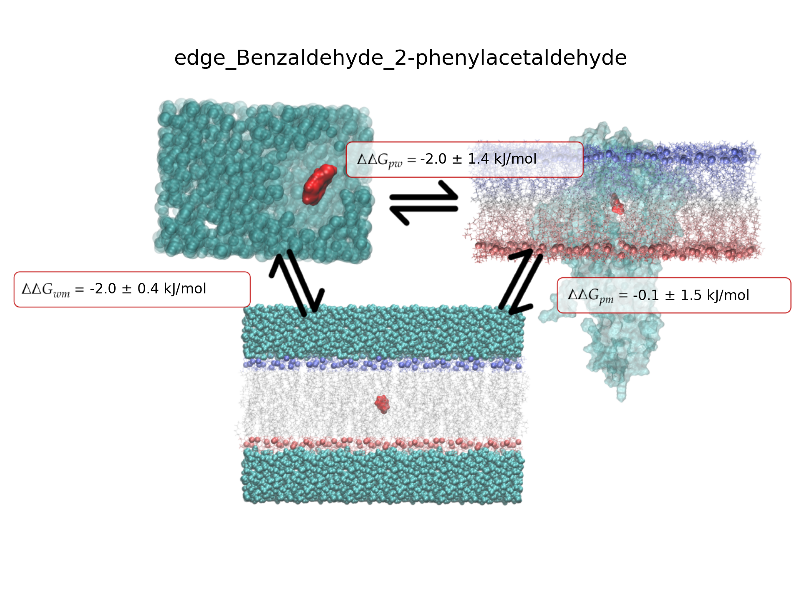

# NEMAT

Non-Equilibrium Membrane Alchemical Transformations


# 1. Requirements

To obtain the code, use:

```bash
git clone https://github.com/QTC-IQAC/NEMAT.git
```

Once the code is downloaded, go to the NEMAT folder and create the environment using:

```bash
conda env create -f environment.yml -n NEMAT
```

Or, if possible (it should be faster):

```bash
mamba env create -f environment.yml -n NEMAT
```


This will take some minutes, be patient! On the other hand, having *[lovoalign](https://m3g.github.io/lovoalign/)* installed is recommended. If not, small molecules can be aligned manually or with any other software. For example, if the molecule contains rings, a program for aligning is provided that relies on _RDkit_.

# 2. Input preparation

## 2.1 CHARMM-GUI

Create the folder *proteins* (or open it if it already exists) and create a subfolder for every protein. Then, process the protein using CHARMM-GUI. The protein used as input in CHARMM-GUI must be the same as that you will use as a reference (*prot_lig.pdb*).

You also need to create a membrane using the same procedure (section 1.2). A standard POPC membrane is provided and can be used. The size of the membrane is 4 nm (XY), and the ions used are Na+ and Cl-. If you use this membrane, you can skip section 1.2.

#### 2.1.1. Protein + membrane system

Prepare the protein + membrane AA system using CHARMM-GUI, ensuring the protein is correctly placed in the membrane. Use only POPC for the membrane to create a simple yet effective membrane. While the lipid is characterised in AMBER, it should be no problem to use a more complex membrane.

Remember to align the protein to the Z axis and use the AMBER FF. The membrane must be parametrised with AMBER for a better reliability with GAFF, with which the small molecules are parametrised.

> [!NOTE]
> In order to establish which part of the protein must be inside the membrane, you can use the server [DeepTMHMM-1.0]( https://services.healthtech.dtu.dk/services/DeepTMHMM-1.0/). Then obtain an IMO string the length of the protein sequence, which will be "I" if the residue is inside the membrane, "M" if it's part of the membrane and "O" if it's outside (i.e., IMMMMMMMMMMMMMOOOOOOOOMMMMMMMMMMMMIIIIIIIIIIIIIIIIIIIIIIIIIIIIIII). Then you can use the program `utils/membrane_bfactor.py`. Change the value of `input_pdb` to the value of the pdb of your protein, the value of `code_string` to the IMO string and the value of `output_pdb` to the value of the original pdb or different if you want to conserve the other b-factor.
>
> Then, when on step 3 of the CHARMM-GUI system generation, download `step3_packing.pdb` and align it to your protein with the changed b-factors. If the membrane matches the predicted zone, you can keep going. Otherwise, restart the characterisation of the protein and move the z-axis value accordingly so that both proteins match in the membrane zone.


Use only the *gromacs* folder of the output generated by CHARMM-GUI. Create the folder *proteins* and add the new protein inside. Rename every folder as the protein and the following files provided by CHARMM-GUI.   

1. *step5_input.gro*   -->   `system.gro`
2. *topol.top*              -->   `system.top`  

The *proteins* folder should contain at least the following:

		proteins
		  |  |
		  |  |-- prot1
		  |  |    |
		  |  |	  |-- toppar
		  |  | 	  |-- system.gro
		  |  |	  |-- system.top
		  |  |	 	
		  |  |-- prot2
		  |  |    |
		  |  |	  |-- toppar
		  |  | 	  |-- system.gro
		  |  |	  |-- system.top
		  |  |	 	
		  |  |-- ...

If, for any case, a different input generator other than CHARMM-GUI is used, then the easiest way to add the force field is to create a folder named *toppar* emulating the one generated by CHARMM-GUI and adding there the *itps* for water, forcefield, protein...  
#### 2.1.2. Membrane system 

Prepare a bilayer membrane system which is consistent with the protein + membrane system. This means using the same kind of water (TP3, OPC...), the same AMBER FF and the same lipids that are on the membrane (usually only POPC). 

The XY size of the box can be approximately 4 nm (40 Å), which means 24 POPCs per layer. For very large ligands (or peptides), this must be increased, which will only have an effect on the running time.  

Take the *gromacs* folder and place it on your workspace. Rename it as `membrane`. Even though the program will only care about the *gro* file, you can have the *mdp* files in `mdppath` replaced and adapted (if the membrane is not solely POPC) by the ones generated by CHARMM-GUI after a proper readjustment.

> [!NOTE]
> If you are using your own *mdp* files, don't forget to add the free energy inputs to all the *mdp* files. At least the `init-lambda` parameter is needed to indicate if the ligand is in state A or B. At the transitions, the other parameters become relevant. This example is for the l0 _mdp_ files.
> 
> ```mdp
> ; Free energy control stuff
> free-energy = yes
> init-lambda = 0 ; 0 for state A and 1 for state B
> delta-lambda = 0
> sc-alpha = 0.3
> sc-sigma = 0.25
> sc-power = 1
> sc-coul = yes
> ```

If you want to use default values, change the *step5_input.gro* file name for *membrane.gro* and the *topol.top* for *membrane.top*. 

If, for any case, a different input generator other than CHARMM-GUI is used, then the easiest way to add the force field is to create a folder named *toppar* emulating the one generated by CHARMM-GUI and adding there the *itps* for water, forcefield, POPC... 

The *membrane* folder should contain at least the following:

		membrane
		  |  |
		  |  |-- toppar
		  |  |-- membrane.gro
		  |  |-- membrane.top

If the small molecule you are trying to use is not that small, consider increasing the number of steps and reducing the tolerance (to 100, for example) on the minimization _mdp_ files. Hopefully, this will avoid problems with the system's equilibration. 

#### 2.1.3. About the *mdp* files

Some things may be difficult to track about the *mdp* files. One of them is the `tc-grps`, and how they are defined. For the protein, we have:

```bash
tc_grps = SOLU MEMB SOLV
```

Where SOLV (for solvent) includes the water and the ions, MEMB is the membrane, and SOLU (for solute) is the protein and the ligand. In the `_prepare_prot_tpr()` function, an index is generated and used in the `grompp` automatically. If you are having problems, look there :).

Again, the program assumes that the input files were generated using CHARMM-GUI. For the membrane, we have:

```bash
tc_grps = MEMB SOLV LIG
```

Which is as stated before but now the ligand, since it's the only solute, is named LIG.

The default *mdp* files are stored in the *mdppath* folder. This folder contains:
	
1. minimization files for the protein, the ligand and the membrane systems. These are named as "prot_em_l0.mdp"
2. Equilibration files for  the protein (6), the ligand (1) and the membrane (6) systems. These are named as "prot_eq(n)\_l0.mdp" where $n \in [1,6]$.
3. Production files for the protein, the ligand and the membrane systems. They are named as "prot_md_l0.mdp" 
4. Finally, the transitions files are named as "prot_ti_l0.mdp".

If you want to change an *mdp* file, we strongly recommend adding only the free energy parameters that are in the original *mdp* file to avoid undesired errors.


### 2.2 Ligand preparation 

First of all we need to align the original protein+ligand system to the newly generated GROMACS system. Use VMD or any aligning tool to align the two proteins. For VMD, you could do:

1. Load the two proteins. In this case: `system.gro` and `prot_lig.pdb`. 
2. Go to `Extensions > Analysis > RMSD calculator`.  This will display a new window.
3. In the top left box, type `name CA`.
4. Unclick the option *Backbone only*.
5. Click *Align* to align the two systems.
6. Save the new ligand coordinates.

> [!WARNING]
> It is important that the GROMACS system (`system.gro`) is marked with the option *"T"* on the VMD main page. If not, the whole system will be aligned to the protein and not the other way around.

Then, extract the ligand which will serve as a reference for aligning the other ligands. Save it as *ref_lig.pdb*.

Add hydrogens to the reference ligand and the rest (for example, using CHARMM-GUI). From here, we have two options. If the ligand contains rings, it is best to use the `align_SM.py` program (default), which will use RDkit for the alignement. If not, maybe it is better to use _lovoalign_. Remember that *lovoalign* needs at least 15 atoms to align 2 molecules, which is usually reached if hydrogens are added. 

Independent of the case, use the program `align.sh` to prepare the ligands and generate `ligands.sdf` and all the necessary files. In this case, it will align the ligands with the reference ligand and then generate *mol2* files for every ligand. You can use the *ligands.sdf* file to both visualise all the ligands at once and, for example, to use some program such as [openFE](https://colab.research.google.com/github/OpenFreeEnergy/ExampleNotebooks/blob/main/openmm_rbfe/OpenFE_showcase_1_RBFE_of_T4lysozyme.ipynb) to generate a mapping of the ligands and determine the possible edges.

If you want to use _lovoalign_ instead of the Python program, comment the 6th line in `align.sh` (`python align_SM.py`) and uncomment the 13th line (`lovoalign -all -p1 ligands/$file -p2 ref_lig.pdb -o aligned/"$base_name"_a.pdb`), which is the _lovoalign_ command.

The *ligands* folder should contain the *mol2* of all the ligands. If you have the ligands as *pdb* or *sdf*, you can use `align.sh` to have them all aligned and transformed to the correct format: 

		ligands
		  |  |
		  |  |-- lig1.mol2
		  |  |-- lig2.mol2
		  |  |-- lig3.mol2
		  |  |-- ...


> [!NOTE]
> Check that the ligand alignment is correct. If the molecule is small, it is possible that something went wrong.
> 
> You can manually align the ligands and directly save the *mol2* files at the *ligands* folder.


## 2.3 Input

An example of an input for the FEP simulation can be found in `input.yaml`:

```yaml
  

##############################
#       PREPARE INPUTS       #
##############################

inputDirName: 'OR31_input' # path to the directory where the input files will be located.
proteinName: 'S31' # name of the protein in inputDirName/proteins that will be used.

##############################
#      SIMULATION INPUT      #
##############################

workPath: 'workpath_BAE_PAE' # path to the directory where the simulations will run
replicas: 3 # set the number of replicas (several repetitions of calculation are useful to obtain reliable statistics)
edges: # List of lists containing the edges.
- ['Benzaldehyde','2-phenylacetaldehyde']
# - ['Acetophenone', 'Benzyl_Alcohol']
# - ['Acetophenone', 'Benzaldehyde']
# - ['2-phenylacetaldehyde', 'Benzyl_Alcohol']

pname: 'NA' # Which positive ions to use in the ligand simulations
nname: 'CL' # Which negative ions to use in the ligand simulations
slotsToUse: 6 # Use if you want to limit the number of jobs running at the same time in the cluster.
frameNum: 200 # Number of frames to extract to make transitions. The default production will generate 400 frames, so this is the default upper limit
temp: 298     # Temperature of the systems in Kelvin.

##############################
#    JOB SUBMISSION INPUTS   #
##############################

JOBsimcpu: 24 # Number of CPUs to use for the simulation jobs
JOBmodules: # List of modules to load for the simulation jobs
- 'gromacs-plumed/2024.2-2.9.2'

JOBgmx: 'gmx mdrun -maxh 72' # Command to run the simulation jobs
JOBpartition: 'gpu' # Partition to use for the simulation jobs
JOBsimtime: '3-00:00' # Time limit for the simulation jobs
JOBmpi: False # Set to True if you want to specifically display -ntmpi 1


##############################
#          ANALYSIS          #
##############################

precision: 1 # Number of decimal places to use in the analysis output (results.png)
framesAnalysis: [0] # Frames that will be taken into account while performing the analysis. All if unset.
```

Remember to load GROMACS using `JOBmodules` if it's a module or manually. More modules can be loaded, but only GROMACS is strictly necessary. 

On the other hand, it is important that the GROMACS executable `gmx` exists. If you only have `gmx_mpi` as an executable, the program will fail.

Other options for the input file are:

----> LIST OF OPTIONS <----


# 3. Running NEMAT

It is recommended to use the Makefile to run the NEMAT code (to avoid errors). 

> [!NOTE]
> You can always use `make check_{step}` to display the warnings and errors that occurred during the preparation of a specific step (*prep*, *min*, *eq*, *md* or *ti*). 
> 
> This will display the warnings and errors produced by GROMACS. Each warning and error is titled as error\_{line} or warning\_{line} where *line* is the line of the original file where the error occurred.
> 
> *IMPORTANT: The check file only searches errors produced by **GROMACS**. If the program has failed before completing every step, you won't be able to use `check_{step}`.* 

Use `make help` to display all the options.


## 3.1 System Assembly

First of all, it is convenient to generate the structure of the simulation results and also process the ligand with *acpype* (creates hybrids of the ligands). To do this, we will use the `prepare_input_md.py` program. This program can be executed using (recommended):

```bash
make prep
```

Or step by step by running (recommended only when debugging):

```bash
python NEMAT/prepare_input_md.py
```

Check the new input folder that was created. It must contain:

1. A folder named *lignads* containing all the ligands involved in the edges.
2. A folder named *proteins* containing the protein files.
3. A folder named *membrane* containing the membrane files.
4. A folder named *mdppath* containing the *mpd* files for the simulations.

Now we can start assembling the system. Use the `file_gestor.py` program to assemble the starting system:

```bash
python NEMAT/file_gestor.py --step prep
```


## 3.2 minimization

> [!NOTE]
> From now on, you can use `make s_{step}` to know if the run was successful for a specific step (*min*, *eq*, *md* or *ti*). If the run was not successful, the failed jobs will be printed. Use this information to track these errors easily.

The only case which needs special care is the membrane + large ligand system. Here, the minimization could crash or may need more steps.

You can prepare the minimization files by using:

```bash
make prep_min
```

This will generate all the job scripts for the SLURM cluster. Then go to your workspace, and you will find a folder named `em_jobscripts` which contains all the files to run the minimization. Then, while inside the `em_jobscripts` folder, use:

```bash
sbatch submit_jobs.sh
```

To submit the job array. 


## 3.3 Equilibration

You can prepare the equilibration files by using:

```bash
make prep_eq
```

This will generate all the job scripts for the SLURM cluster. Then go to your workspace, and you will find a folder named `eq_jobscripts` which contains all the files to run the equilibration. Then, while inside the `eq_jobscripts` folder, use:

```bash
sbatch submit_jobs.sh
```


## 3.4 Production

You can prepare the production files by using:

```bash
make prep_md
```

This will generate all the job scripts for the SLURM cluster. Then go to your workspace, and you will find a folder named `md_jobscripts` which contains all the files to run the production. Then, while inside the `md_jobscripts` folder, use:

```bash
sbatch submit_jobs.sh
```

Since some systems may be too large to run in a single run (for example, you have a time limit of 3 days per run), an automatic checkpoint submission file (and the corresponding job scripts) is generated. You may not need to use it if the simulation is already over. Use:

```bash
sbatch submit_jobs_cpt.sh
```
After the first dynamics are over. You could make it "automatic" by using:

```bash
sbatch submit_jobs_cpt.sh --dependency:afterokay=<job_id>
```
Where `<job_id>` is the ID of the first Dynamics submission job script.

## 3.5 Transitions

You can prepare the transition files by using:

```bash
make prep_ti
```

This will generate all the job scripts for the SLURM cluster. This step takes more than the other ones since it needs to process all the production outputs (using the default values of 200 frames, approximately 1h per edge). 

Then go to your workspace, and you will find a folder named `transitions_jobscripts` which contains all the files to run the transitions. Then, while inside the `transitions_jobscripts` folder, use:

```bash
sbatch submit_jobs.sh
```

# 4. Analysis

You can perform a complete analysis of the FEP calculation by using:

```bash
make analyse wp=workpath_path
```
If 400 frames are generated and _nframes = 200_ then transitions for the last 200 frames will be performed (named from 0 to 199).

You can use the `input.yaml` file to set specific options by using the `framesAnalysis` parameter. Take into account that the frame numbers are 0-based:
	* If it is unset, the  last _nframes_ will be used **for the analysis**.
 	* If the value is [n], the analysis will start from the n frame.
  	* If the value is [n,m], the analysis will be conducted for the frames in the interval n,m (both included).
   	* If the value is a list containing n frames (i.e. [1,5,20,31,...]), only these frames will be used for the analysis.

### 4.1. Files

This will create the files `results_all.csv` and `results_summary.csv` in your working directory. The first file contains:

```csv title:results_all.csv
,val,err_analyt,err_boot,framesA,framesB

edge_Benzaldehyde_2-phenylacetaldehyde_water_1,-68.26,0.05,0.05,200.0,200.0
edge_Benzaldehyde_2-henylacetaldehyde_protein_1,-66.15,0.68,0.72,200.0,200.0
edge_Benzaldehyde_2-phenylacetaldehyde_membrane_1,-69.52,0.2,0.2,200.0,200.0
[...]
```

For every edge and every replica. At the end, you can find the mean and the error per edge:


```csv title:results_all.csv
,val,err_analyt,err_boot,framesA,framesB
[...]
edge_Benzaldehyde_2-phenylacetaldehyde_water,-68.24666666666667,0.0380985598656302,0.036696463387330035,,
edge_Benzaldehyde_2-phenylacetaldehyde_protein,-70.295,1.4288139603312873,1.4277693758149088,,
edge_Benzaldehyde_2-phenylacetaldehyde_membrane,-70.22000000000001,0.3961824788299467,0.39328642887178056,,
```

In this case, we have:

$$\Delta G_{w} = -68.24 \pm 0.03 $$
$$\Delta G_{p} = -70.30 \pm 1.42 $$
$$\Delta G_{m} = -70.2 \pm 0.4 $$

The other file, contains information about the $\Delta\Delta G$ values for every edge:

```csv title:results_summary.csv
,dG_wp,dG_mp,dG_wm,err_analyt_wp,err_boot_wp,err_analyt_mp,err_boot_mp,err_analyt_wm,err_boot_wm
edge_Benzaldehyde_2-phenylacetaldehyde,-2.048333333333332,-0.07499999999998863,-1.9733333333333434,1.4293218089364665,1.4282408833736808,1.4827238076490912,1.4809455106956542,0.39801012147390946,0.3949947411800007
...
```


$$\Delta \Delta G_{wp} = -2.0 \pm 1.4 $$
$$\Delta G_{pm} = -0.1 \pm 1.5 $$
$$\Delta G_{pm} = -2.0 \pm 0.4 $$

### 4.2. Plots

Inside the work path folder, you will find a folder named `plots` which contains $3\cdot e \cdot r$ plots where $e$ is the number of edges and $r$ the number of replicas per edge (i.e., if we have one edge and 3 replicas, this would mean 9 plots). 

These plots, generated using PMX, show the forward and backwards transitions of the alchemical transformation:


You want as much overlap as possible. More overlap means less error in the predicted free energy. Usually, the water alchemical transformation has good overlap, and the difficulties come with the protein or, sometimes, at the membrane.

In order to obtain the final value for every $\DeltaG$, a weighted mean is performed so that if one value seems off (for example, because there is nearly no overlap), its weight is low.

Inside every edge, you will find a summary of the results in the image named *results.png*:




This contains, in a graphical way, the results of the `results_summary.csv`. You can tune the number of decimals (`precision`, recommended no more than 3) and use:

```bash
make img
```

To redo all the images without redoing the analysis.

### 4.3 Validation.

Since using membrane, water and protein + membrane systems creates a closed cycle, we can perform a validation test such that

$$\Delta\Delta G_{wp} \pm 2\delta(\Delta G_{wp}) \quad =? \quad \Delta\Delta G_{wm} - \Delta\Delta G_{mp} \pm 2\delta(\Delta G_{wm}-\Delta G_{mp})$$
Use `make val` to print the validation test for every edge after the analysis has been performed.


# 5. Other features

## 5.1. Clean backup files

Since multiple edges can be run at once, the number of useless backup files generated can grow quite high. Hence, you can use `make clean` to erase all backup files. If you do so, a message will be prompted indicating how much space the files occupy and how many files there are. If you choose to remove them, all of them will be erased.

## 5.2. Reset run

In case you need to start your run again (for example, you find an error), using `make new` will reset the workspace so that you need to start from the preparation of the system. 

# 6. Possible errors 

### 1. Energy minimization has stopped

> [!CAUTION]
> Energy minimization has stopped, but the forces have not converged to the
requested precision Fmax < 1000 (which may not be possible for your system).
It stopped because the algorithm tried to make a new step whose size was too
small, or there was no change in the energy since last step. Either way, we
regard the minimization as converged to within the available machine
precision, given your starting configuration and EM parameters.

This is not necessarily an error, and it will depend on the final values of especially the maximum force:

```bash
Potential Energy  =  4.8533396e+09
Maximum force     =  1.2402948e+12 on atom 8201
Norm of force     =  3.6336824e+09
```

If values are larger than $10^3$, something has gone wrong. A possible solution is to enlarge the PBC box a little bit (for example, 0.2 per side is enough, but you can enlarge it more). 

This will usually occur if the protein is large and, therefore, the membrane must be too in order to avoid rings with the protein. Check for this error if the minimization ends with no problems, but equilibration is crashing.
